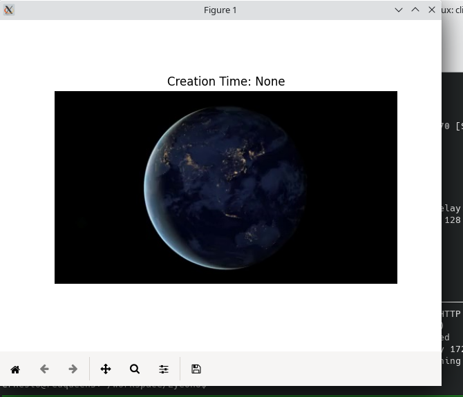

# EyeOnU


Siempre que se creen cambios hacer pull y ejecutar el archivo `requirements.txt` o instalar manualmente las dependencias 

## Instalaciones:

```bash 
pip install Flask-SQLAlchemy
pip install Flask
pip install sqlalchemy psycopg2-binary
pip install opencv-python
pip install flask-migrate
pip install google-generativeai
pip install boto3
pip install python-dotenv
pip install flask-socketio
pip install flask-cors
pip install gevent
```

## Crear base de datos
`psql -U postgres`
`create database prueba owner postgres;`

## Crear tablas
```
flask db init
```
```
flask db migrate -m "Initial migration"
```
```
flask db upgrade
```
## Instalación con requirements.txt
Crea un entorno virtual de Python
```bash 
python3 -m venv venv
source venv/bin/activate
```
En Windows :
```bash 
source venv\Scripts\activate
```
Instala dependencias desde 'requirements.txt''
```bash
pip install -r requirements.txt
```

## Correr pruebas unitarias: 
```bash 
python -m unittest discover -s tests -v
```

## Crear contenedor
```bash
docker build -t eyeonu-api .
```

## Correr contenedor
```bash
docker run -p 5000:5000 eyeonu-api
```

## Correr contenedor en modo prueba
```bash
docker run -p 5000:5000 eyeonu-api python app.py --test
```
## Crear docker-compose
```bash
docker-compose build
```
## Correr docker-compose en modo test
```bash
docker-compose run flaskApi python app.py --test
```

## Correr docker-compose 
```bash
docker-compose up --build
```

## Bajar contenedores 
```bash
docker-compose down -v
```

## Probar servidor de stream para demo:

### [Levantar](https://stackoverflow.com/questions/26999595/what-steps-are-needed-to-stream-rtsp-from-ffmpeg) contenedores

```bash
docker compose down --remove-orphans
docker compose up --remove-orphans demo_video_feed
```


### Testear que funciona good

```bash
PYTHONPATH=. python3 src/prueba_frames/frame.py
```
Debe salir una ventana con un still del video:


